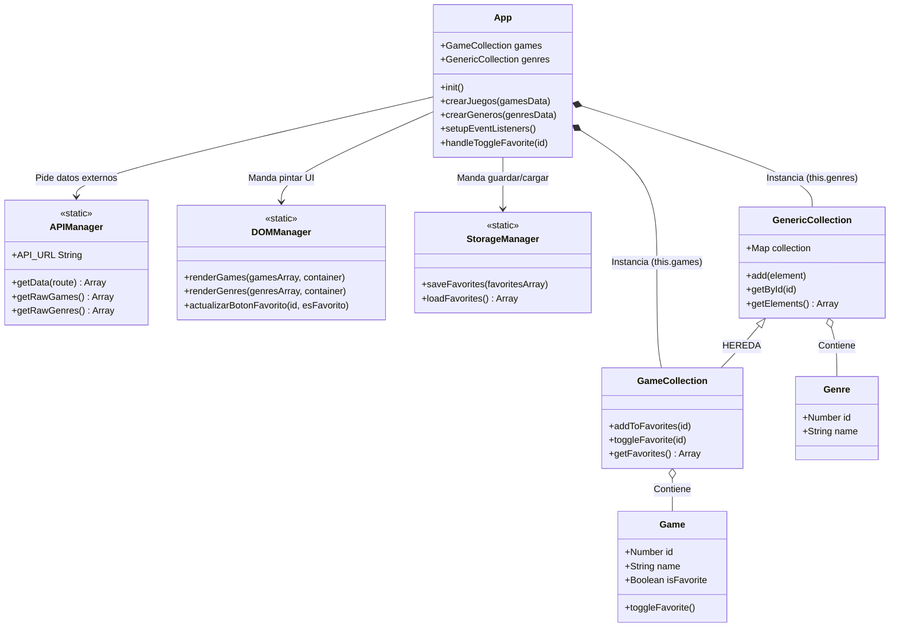
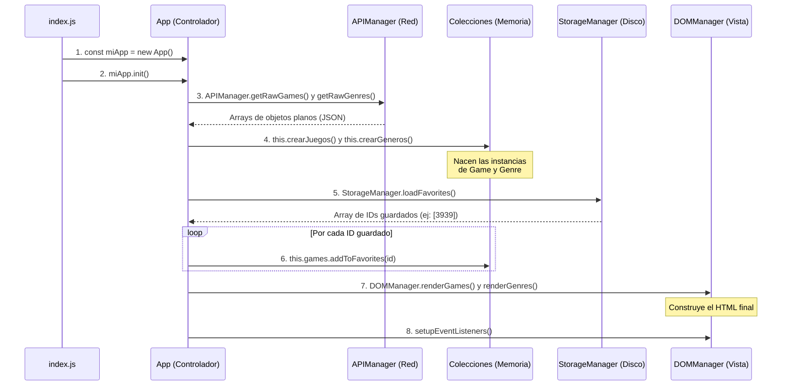
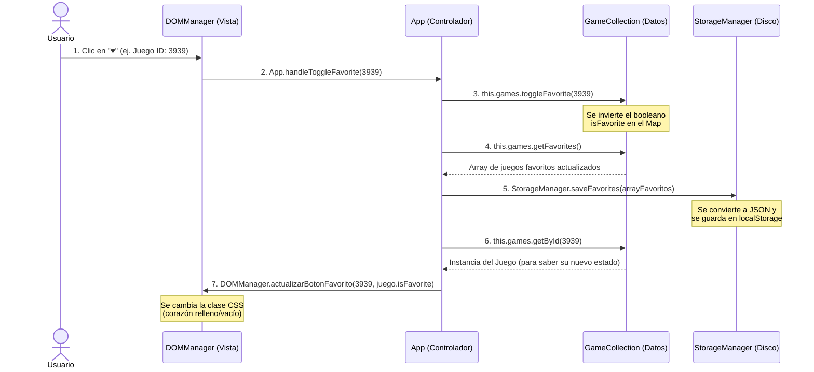

# 🎮 Explorador de Videojuegos (Vanilla JS & POO)

Este proyecto es una aplicación Frontend construida íntegramente con **JavaScript Vanilla**. Su objetivo principal es aplicar los principios de la **Programación Orientada a Objetos (POO)** y la **Arquitectura Limpia (MVC)** para crear una aplicación robusta, escalable y fácil de mantener.

La aplicación consume datos de la [RAWG Video Games API](https://rawg.io/apidocs), permite explorar un catálogo de juegos, filtrar por géneros y gestionar una lista de favoritos persistente en el navegador.

## ✨ Funcionalidades

- **Carga dinámica de datos:** Conexión asíncrona a la API de RAWG para obtener juegos y géneros.
- **Filtrado:** Capacidad para ver los juegos asociados a un género específico.
- **Sistema de Favoritos:** Posibilidad de añadir o quitar juegos de una lista de favoritos.
- **Persistencia de Datos:** Los favoritos se guardan en el `localStorage` del navegador para no perderlos al recargar la página.
- **Gestión de Errores Custom:** Uso de clases de error propias (`MissingIDError`, `ElementNotFoundError`) para un control de excepciones preciso.

## 🏗️ Arquitectura del Proyecto

El código está diseñado separando estrictamente las responsabilidades. El núcleo de datos no sabe nada de la interfaz de usuario, y la interfaz no sabe cómo se guardan los datos. Todo está orquestado por un controlador central.

### 1. Modelos y Colecciones (El Core / Datos)
Clases puras que solo manejan datos en la memoria RAM:
- `Game` y `Genre`: Representan las entidades individuales.
- `GenericCollection`: Clase base (herencia) que gestiona un mapa (`Map`) de elementos.
- `GameCollection`: Extiende de la base y añade lógica de negocio específica (filtros, toggle de favoritos).

### 2. Infraestructura (Los Managers)
Clases estáticas que se comunican con el "mundo exterior":
- `APIManager`: Gestiona las peticiones `fetch` a la red.
- `DOMManager`: Traduce los objetos a elementos HTML y los pinta en la pantalla.
- `StorageManager`: Serializa los datos (JSON) para guardarlos y leerlos del Disco Duro (`localStorage`).

### 3. El Controlador Principal
- `App`: Es el cerebro de la aplicación. Inicializa los datos, escucha los eventos de la vista y coordina las colecciones con los Managers.

## 🗺️ Diagrama de Clases



## Diagramas de Secuencia
### Secuencia de Inicialización


### Secuencia de Favoritos



## 🚀 Instalación y Uso

1. Clona este repositorio:
```bash
git clone git@github.com:LdMe/API-Juegos.git

```


2. Obtén una API Key gratuita en [RAWG](https://rawg.io/apidocs).
3. Añade tu API Key en la clase `APIManager` (reemplazando `"TU_API_KEY_AQUI"`).
> **Nota de seguridad:** En un entorno de producción real, la API key debería estar protegida en el backend o mediante variables de entorno.


4. Abre el archivo `index.html` en tu navegador usando **Live Server** (extensión de VS Code) para evitar problemas de CORS.

## 🧠 Próximos Pasos (Retos)

* [ ] Implementar paginación desde la API.
* [ ] Añadir una barra de búsqueda por nombre de juego.
* [ ] Crear una vista de "Detalles del Juego" usando el ID.

---

*Proyecto desarrollado con ❤️ como parte del módulo de JavaScript Frontend.*
